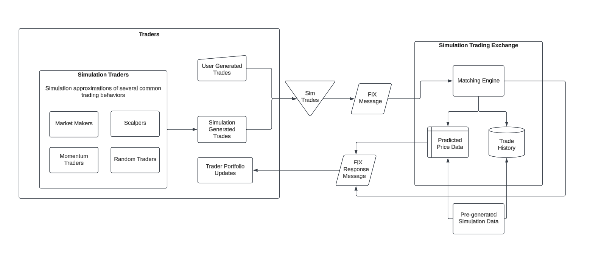

# Overview
This project is a simulation stock exchange designed to model order matching, trade executions, and market dynamics. The project is meant to serve as a high-performance environment for testing trading strategies and modeling market behavior.

The matching engine was primarily developed in C++ and connects to an intermediary Python service that handles responses from the engine. Previous trades and responses are stored in a Postgres database server, which are accessible by trading agents. Users may upload trades and maintain a portfolio individually via a Flask API (WORK IN PROGRESS).

## Design Workflow
An initial workflow of the project can be seen below.



# Features
- Order Matching Engine: Implements a limit order book for efficient trade execution via socket connections.
- Kafka Integration: Uses Apache Kafka for reliable trade queuing and message passing (WORK IN PROGRESS).
- PostgreSQL Database: Stores historical trades and order book data using Supabase.
- Trading Agents: Simulation agents, including market makers and RL models, actively place trades to simulate a dynamic market environment (WORK IN PROGRESS).
- API: A Flask API allows for user trades to be placed and an individual portfolio to test trading strategies. 
- Modular Architecture: Designed for extensibility and high performance.

# Usage
## Setting up the engine
Download the docker images from below. Run them via 

```
docker-compose up -d
```

This will run the matching engine in the background, which can receive ```OrderMessage``` objects, as defined in ```./protocols/trademessage.proto``` on port ```56000```. Responses will be uploaded automatically to the Postgres server.

Currently, the engine is set to run on port ```56000``` and the uploading service on port ```56001```. These values can be changed in their respective Dockerfiles, which are found in ```./trade-messaging-service``` and ```./matching-engine```, as well as in ```docker-compose.yml```.
#### Alternative Local Setup
Alternatively, instead of running via docker container, you can run locally.

First, start the trade messaging service by installing ```./trade-messaging-service/requirements.txt```, then running ```python3 trade-messaging-service/main.py```.

Then, start the matching engine by first installing protobuf, which can be done via ```apt-get install protobuf-compiler```, then running, from ```./matching-engine/```,

```
mkdir build && cd build
cmake ..
make
```

Doing so will create an executable ```./matching-engine/build/exchange```, which can be run to start the engine.

## Sending trades
Currently, user trades can be sent after starting both other services by running ```./tests/python/test.py```, which will prompt for a user trade that can be used for debugging purposes.

# Docker Images
[Matching Engine](https://hub.docker.com/r/arcanefz/matching-engine)

[Trade Messaging Service](https://hub.docker.com/r/arcanefz/trade-messaging-service)

